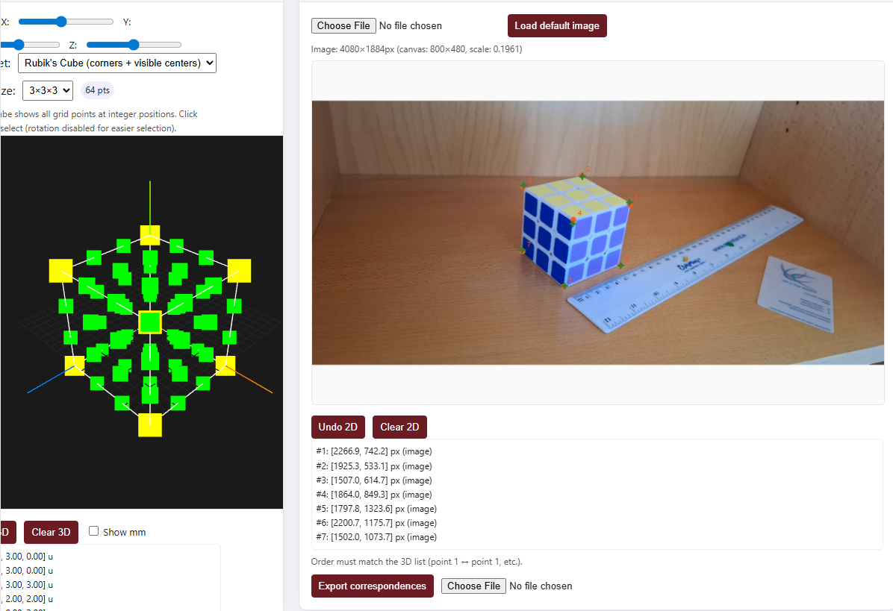
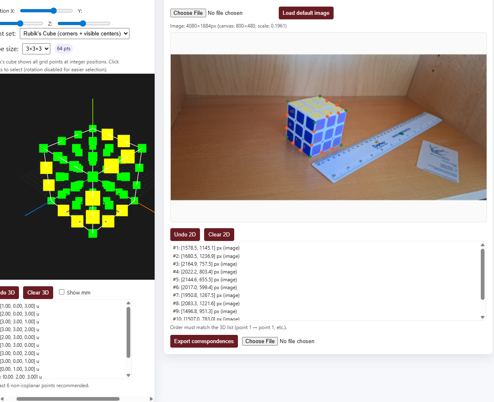
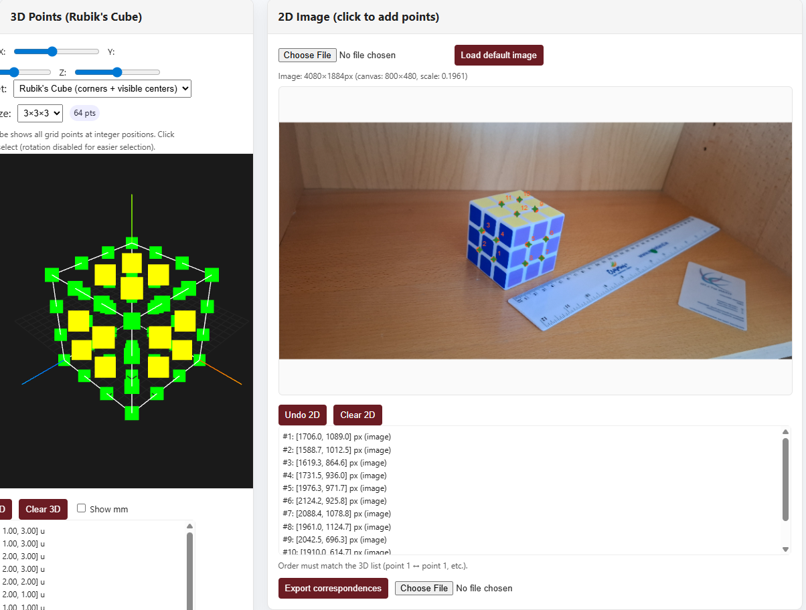

# Trials for DLT Computation

## Run 1 - Selected 7 corner points of Rubik's Cube

* Number of points: 7
* RMSE (px): 13.980
* Rank(A): 12

Projection Matrix P:
$$\begin{bmatrix}
0.016463 & 	-0.013253	& -0.084878 & 	0.886001 \\
0.016623 & 	-0.070812	& -0.000001 & 	0.449512 \\
-0.000014 & 	-0.000010	& -0.000016 & 	0.000468
\end{bmatrix}
$$

K (Intrinsic):
$$\begin{bmatrix}
2997.6279 & 129.5422 & 2219.8378 \\
0.0000 & 2993.5226 & 819.5487 \\
0.0000 & 0.0000 & 1.0000
\end{bmatrix}
$$

R (Rotation):
$$\begin{bmatrix}
-0.6739 & -0.1582 & 0.7217 \\
-0.4059 & 0.8954 & -0.1828 \\
0.6173 & 0.4161 & 0.6677
\end{bmatrix}
$$

t (Translation): $\begin{bmatrix}2.2231 & -0.9379 & -19.9780\end{bmatrix}$

Camera Center C: $\begin{bmatrix}13.4495 & 9.5051 & 11.5631\end{bmatrix}$ (world units)

* $f_x$=2997.6279 px, $f_y$=2993.5226 px
* Principal pt: (2219.8378, 819.5487) px
* Image center: (2040.0, 942.0)
* Offset from center: (179.8, -122.5) px

1.  [2266.9, 742.2] → [2264.3, 725.4] Δ=(2.64, 16.78)
2.  [1925.3, 533.1] → [1927.9, 540.1] Δ=(-2.66, -6.98)
3.  [1507.0, 614.7] → [1509.2, 604.8] Δ=(-2.15, 9.95)
4.  [1864.0, 849.3] → [1860.3, 878.2] Δ=(3.75, -28.83)
5.  [1797.8, 1323.6] → [1801.6, 1321.6] Δ=(-3.87, 2.02)
6.  [2200.7, 1175.7] → [2202.0, 1175.6] Δ=(-1.30, 0.16)
7.  [1502.0, 1073.7] → [1498.8, 1067.1] Δ=(3.18, 6.66)

## Run 2 - Selected 12 points including edge midpoints

* Number of points: 12
* RMSE (px): 8.334
* Rank(A): 12

Projection Matrix P:
$$\begin{bmatrix}
-0.007431 & 	0.007731 &	0.076385 & 	-0.883383 \\
-0.007929 & 	0.068516 &	-0. & 005560	-0.457052 \\
0.000022 & 	0.000008 &	0.000012 & 	-0.000477
\end{bmatrix}
$$

K (Intrinsic):
$$\begin{bmatrix}
-2661.9420 & 125.1217 & 1150.74 \\
0.0000 & -2559.41217 & 479.9645 \\
0.0000 & 0.0000 & 1.0000
\end{bmatrix}
$$

R (Rotation):
$$\begin{bmatrix}
-0.4786 & 0.0159 & 0.8779 \\
-0.2731 & 0.9476 & -0.1660 \\
-0.8345 & -0.3192 & -0.4492 \\
\end{bmatrix}
$$

t (Translation): $\begin{bmatrix}-4.8846 & -3.3533 & 17.9543\end{bmatrix}$

Camera Center C: $\begin{bmatrix}11.7288 & 8.9855 & 11.7966\end{bmatrix}$ (world units)

* fx=-2661.9420 px, fy=-2559.4217 px
* Principal pt: (1150.7400, 479.9645) px
* Image center: (2040.0, 942.0)
* Offset from center: (-889.3, -462.0) px

1. [1578.5, 1145.1] → [1578.7, 1149.2] Δ=(-0.26, -4.12)
2. [1680.5, 1236.9] → [1685.6, 1233.4] Δ=(-5.18, 3.51)
3. [2164.9, 757.5] → [2160.0, 752.6] Δ=(4.95, 4.96)
4. [2022.2, 803.4] → [2019.9, 792.8] Δ=(2.22, 10.60)
5. [2144.6, 655.5] → [2148.4, 656.4] Δ=(-3.85, -0.90)
6. [2017.0, 599.4] → [2020.2, 604.1] Δ=(-3.12, -4.64)
7. [1950.8, 1267.5] → [1947.0, 1272.2] Δ=(3.75, -4.67)
8. [2083.3, 1221.6] → [2080.3, 1220.2] Δ=(3.04, 1.47)
9. [1496.8, 951.3] → [1493.7, 936.3] Δ=(3.11, 15.07)
10.  [1507.0, 783.0] → [1505.4, 793.5] Δ=(1.68, -10.48)
11.  [1818.2, 1170.6] → [1825.9, 1171.2] Δ=(-7.74, -0.61)
12.  [1848.8, 997.2] → [1847.6, 1007.5] Δ=(1.19, -10.29)

## Trial 3 - Selected 15 points including edge midpoints and face centers

* Number of points: 12
* RMSE (px): 6.677
* Rank(A): 12

Projection Matrix P:
$$\begin{bmatrix}
0.040876	& -0.021926	& -0.068592 &	0.880199 \\
0.027653	& -0.082092& 	0.012035 &	0.459070 \\
-0.000005	& -0.000017	& -0.000006 &	0.000474
\end{bmatrix}
$$

K (Intrinsic):
$$\begin{bmatrix}
4055.3579 & 69.0441 & 1641.6953 \\
0.0000 & 3074.1356 & 3450.7536 \\
0.0000 & 0.0000 & 1.0000
\end{bmatrix}
$$

R (Rotation):
$$\begin{bmatrix}
-0.6181 & -0.0938 & 0.7805 \\
-0.7477 & 0.3766 & -0.5469 \\
0.2426 & 0.9216 & 0.3029
\end{bmatrix}
$$

t (Translation): $\begin{bmatrix}-1.6766, 20.2172, -25.0406\end{bmatrix}$

Camera Center C: $\begin{bmatrix}20.1558, 15.3066, 19.9506\end{bmatrix}$ (world units)

* fx=4055.3579 px, fy=3074.1356 px
* Principal pt: (1641.6953, 3450.7536) px
* Image center: (2040.0, 942.0)
* Offset from center: (-398.3, 2508.8) px